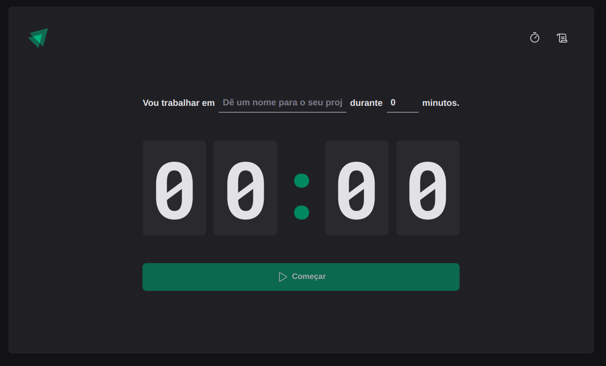

# ignite-react-pomodoro

Pomodoro timer application built with TS/React as part of Rocketseat's Ignite bootcamp.

What is the Pomodoro Technique?

A time management method that uses a timer to break work into intervals, traditionally 25 minutes in length, separated by short breaks. This app helps you manage your time more effectively by providing a simple and intuitive interface to track your work and break periods.



## Features

- **Customizable Timer**: Set your own work and break intervals.
- **Task Management**: Add multiple cycles to keep track of what you're working on.
- **Progress Tracking**: Visualize your progress with a simple and clean UI.

## Stack

- JavaScript
- TypeScript
- React
- CSS Modules

Originally, the project was built using styled components. I have used CSS Modules to challenge myself and learn more about it.

## Getting started

### Prerequisites

Make sure you have the following installed on your machine:

- Node.js (v14 or higher)
- npm (v6 or higher) or yarn

### Installation

1. Clone the repository:

```sh
git clone https://github.com/yourusername/ignite-react-pomodoro.git
cd ignite-react-pomodoro
```

2. Install the dependencies:

```sh
npm install
# or
yarn install
```

### Usage

To start the development server, run:

```sh
npm run dev
```

This will start the app. The app will automatically reload if you make changes to the code.

## Contributing

Contributions are welcome! Please open an issue or submit a pull request if you have any improvements or bug fixes.
